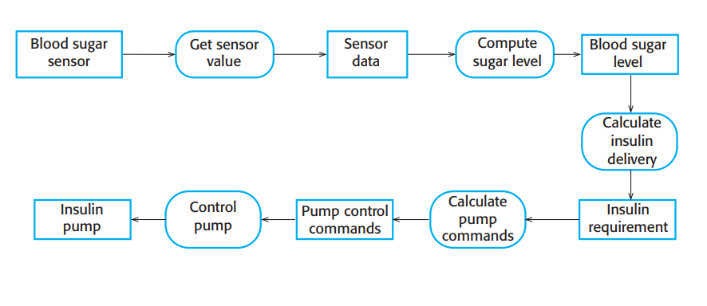
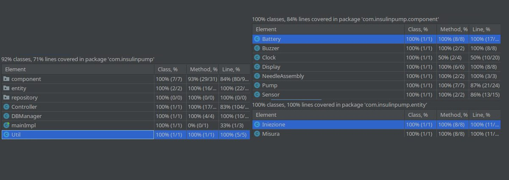

# InsulinVita 3000 - Personal Insulin Pump
Sistema integrato per una pompa per insulina per malati di diabete.  
Aiuta a mantenere sotto controllo il livello glicemico del paziente attraverso una somministrazione continua di piccole dosi d'insulina nell'arco della giornata.  
L'apparecchio possiede un sensore in grado di rilevare il livello di glucosio presente nel sangue del paziente. Il quantitativo di insulina da iniettare è calcolato da un micro-controllore posizionato nella pompa che basa i suoi calcoli sulle letture precedenti trasmesse dal sensore.  
Trattandosi di un apparecchio medico il committente ha richiesto la massima attenzione nella progettazione e nella realizzazione del prodotto così da evitare eventuali danni, anche permanenti, al paziente.
## Indice
- [Requisiti](#requisiti)
- [Scenari](#scenari)
- [Design](#design)
- [Implementazione](#implementazione)
- [QA e Testing](#qa-e-testing)

## REQUISITI

### REQUISITI FUNZIONALI

* Rilevamento del livello di glucosio nel sangue periodico (10 minuti)
* Calcolo dose di insulina da erogare
  * Il calcolo sarà basato sulle tre letture del sensore più recenti, così da poter capire se il livello del glucosio sta salendo, scendendo o sta rimanendo grosso modo costante.
  * Le dosi dovranno essere sufficienti per mantenere sotto controllo la glicemia del paziente. Il committente ha fornito la formula brevettata per il calcolo.
* Erogazione dell'insulina attraverso una pompa elettrica e aghi
  * L'erogazione avverrà ogni 10 minuti, dopo la lettura del glucosio, e solo se la dose calcolata dal sistema sarà di almeno 1 unità insulinica
* System check periodico (1 minuto)
  * Segnalazione automatica esaurimento d'insulina nella pompa
    * La segnalazione avverrà sia attraverso una spia sui display, sia con un cicalino 
  * Segnalazione automatica esaurimento carica delle batterie (Pompa e Sensore)
    * La segnalazione avverrà sia attraverso una spia sui display, sia con un cicalino 
  * Segnalazione automatica malfunzionamenti hardware/software
    * Il sistema dovrà quindi dotarsi di un sistema di auto diagnosi in modo da poter rilevare e cercare di risolvere i problemi in modo autonomo, senza l'interazione dell'utente  
* Visualizzazione su display dei dati rilevati
* Visualizzazione su display dello storico dei dati rilevati

### REQUISITI NON FUNZIONALI

* Durata (stimata) del sistema di almeno 3 anni
* Pompa: 
    * Durata della batteria di almeno 7 giorni
    * Capacità del serbatoio compresa fra 280-320 unità
    * Dimensioni massime della pompa: 5.5cm x 10.0cm x 2.5cm
    * Peso massimo (vuoto): 30.0g
    * Impermeabile per 60 minuti a un massimo di 10 metri di profondità
    * Display con dimensione minima di 2 pollici
* Sensore:
    * Durata della batteria di almeno 7 giorni
    * Precisione: MARD (Mean Absolute Relative Difference ) inferiore a 10%
    * Dimensioni massime: 3.0cm x 4.0cm x 1.5 cm
    * Peso massimo: 10.0g
    * Impermeabile per 60 minuti a un massimo di 10 metri di profondità
    * Display portatile:
    * Dimensioni schermo: minimo 2 pollici
* Batterie litio ricaricabili tramite porte la porta standard USB-C
* Tempo massimo prima del rilevamento di un guasto di 3 minuti
* Abbastanza capacità di archiviazione per il salvataggio delle rilevazioni storiche degli ultimi 6 mesi
* Delay massimo risposta UI 3 secondi
* Facilità d' utilizzo
  * Interfaccia semplice da capire
  * Pochi pulsanti per non confondere l'utente
* Ampio testing:
  * Test unità con copertura media dei metodi > 80% e delle istruzioni > 66%
  * Test d'accettazione
* Documentazione del codice chiara ed abbondante per favorire la maintenance
* Sistema conforme a tutte le norme Italiane in materia

### MATERIALE COMMITTENTE
Il committente ha fornito il seguente materiale, che richiede che venga integrato all'interno dell'apparecchio sia dal punto di vista fisico che software.

#### Formula per il calcolo della dose d'insulina
Il committente ha brevettato la seguente formula per calcolare la giusta dose di insulina da iniettare ad un paziente qualora il livello glicemico si trovi fra 3 mmol/L e 7 mmol/L:

Indicando con r2 la lettura più recente del sensore e con r1, r0 le due letture precedenti:
| Condizione Glucosio                                                    | Computazione della dose              |
| ---------------------------------------------------------------------- | ------------------------------------ |
| Stabile o in calo r2 <= r1                                          | 0                                    |
| In aumento, ma ad un ritmo inferiore (r2 - r1) < (r1 - r0)          | 0                                    |
| In aumento, ad un ritmo in aumento o stabile (r1 - r1) >= (r1 - r0) | Max(MinimumDose, Round((r2 - r1)/4)) |

#### Bozza del design

Come si può notare dallo schema:
* 2 Display
* Il sensore può comunicare col controller (via wireless se possibile)
* Il controller può azionare il cicalino
* Il controller è dotato di un orologio
* Il controller comunica con la pompa
* La pompa, con l'ausilio di aghi, inietta l'insulina presente nel proprio serbatoio nel paziente una volta ricevuto il comando dal controller
* Il sistema è ovviamente alimentato da una sorgente elettrica.

#### Bozza del funzionamento

## SCENARI

### Scenario 1

### Scenario 2

### Scenario 3

### Scenario 4

### Scenario 5

## DESIGN
.
.
.
.
.
.
### USE CASE DIAGRAMS

### ACTIVITY DIAGRAMS

### SEQUENCE DIAGRAMS

## IMPLEMENTAZIONE
Lo sviluppo del controller verrà effettuato col linguagio *Java*.
L'interfaccia utente sarà implementata usando *HTML* e *Bootstrap*, ottimizzando il design per un display touch.  
Il database sarà di tipo *Sqlite* in quanto molto leggero e ben si presta all'utilizzo in sistemi embedded locali.  
L'accesso alla base di dati verrà gestita da *Spring JPA*.
Le pagine HTML saranno servite da un server Tomcat attraverso l'uso di *Spring Boot* con *Thymeleaf*.
Si tratta di tecnologie ben consolidate e largamente adottate da molte aziende in tutto il mondo. Così facendo speriamo di tagliare sia i tempi di produzione che i bug. Questo secondo punto è specialmente importante data la natura sanitaria dell'apparecchio.

La documentazione varrà prodotta con lo standard *javadoc*.

>**Nota fuori RP**: *Professore, abbiamo implementanto principalmente il componente controller, lo schedulatore (clock) e l'UI di uno dei display touch.  
Tutto ciò che è hardware (pompa, batterie, sensore, ecc) è simulato.  
La presenza dei pulsanti di "debug" nell'interfaccia web è ovviamente fatta solo per poter simulare azioni che richiederebbero di avere sotto mano l'hardware (come per esempio cambiare la batteria).*

### Tool di Sviluppo
Come IDE verrà utilizzato *IntelliJ Idea™* come di consuetudine per la nostra azienda (*immaginaria, ndr.*).  
Per quanto riguarda il version control ci affideremo a *GIT*, che è ormai uno standard nel nostro settore.  
La gestione delle librerie ed in generale l'automazione dello sviluppo verrà affidato a *Gradle*  
I diagrammi presenti in questo documento sono stati prodotti attraverso l'utilizzo del software commerciale *StarUML™* e della webapp *genmymodel*.

## QA e TESTING
Come da requisiti verrà condotti sia dei test d'unità che degli acceptance test.
I test d'unità verranno costruiti usando il framework gratuito *junit*.  
I test d'accettazione oltre ad utilizzare *junit* si avvarranno anche di *HTMLUnit* per simulare l'interazione dell'utente con l'interfaccia grafica.

I test d'unità verranno raccolti all'interno della suite UnitTestSuite.java  
Per avviarli basterà runnare la suite.

I test d'accettazione verranno raccolti all'interno della suite AcceptanceTestSuite.java  
Prima di avviare la suite sarà necessario aver avviato anche il programma col profilo bootrun (./gradlew bootrun)

Al momento della scrittura di questo documento il coverage dei test supera di gran lunga quanto richiesto dal committente. La nostra azienda ha ben chiara l'importanza del QA. 

Per ogni singolo test prodotto è disponibile la descrizione nei javadoc.