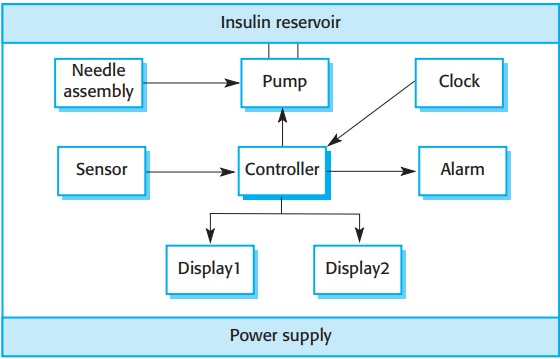
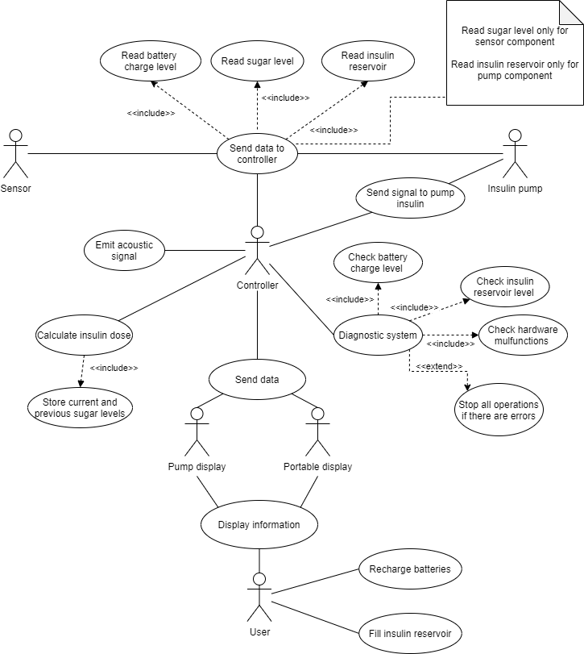
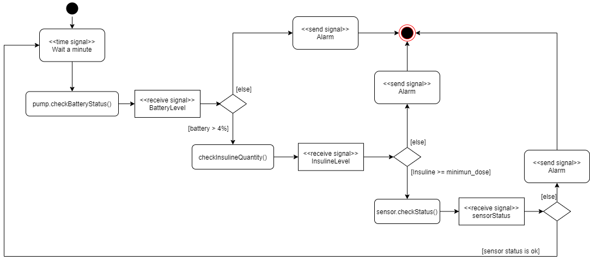
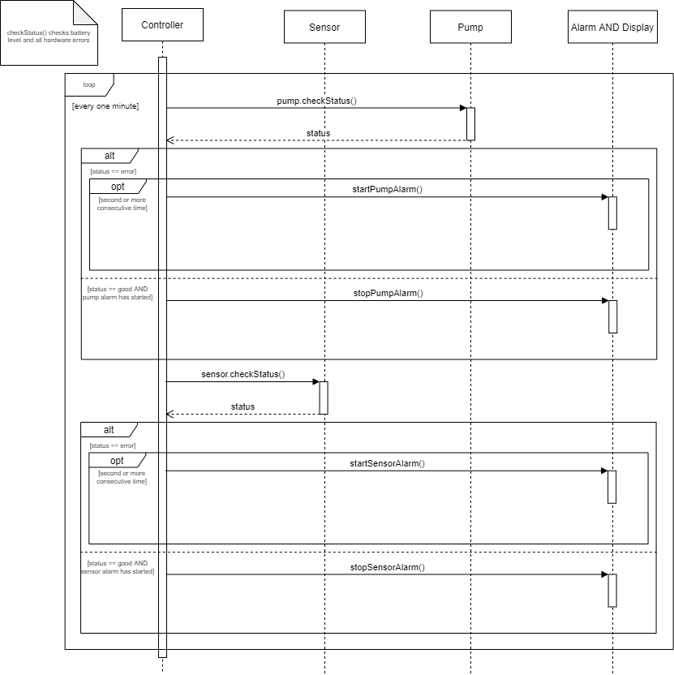
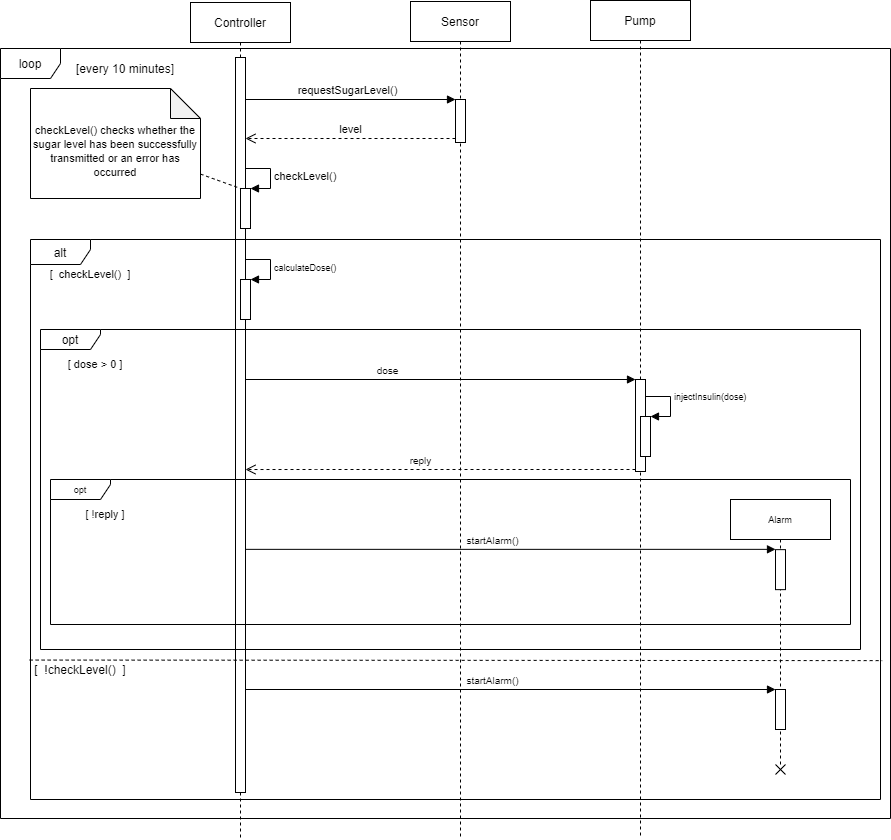
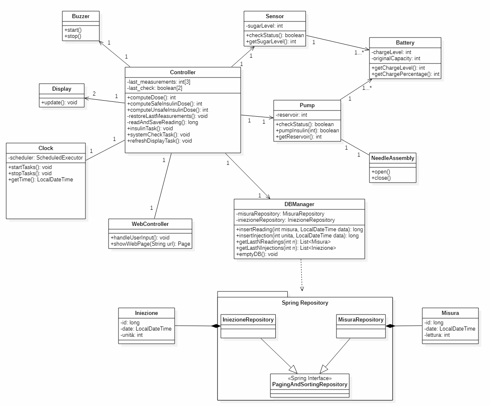
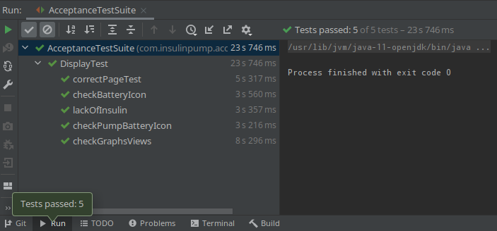

# InsulinVita 3000 - Personal Insulin Pump
Sistema integrato per una pompa per insulina per malati di diabete.  
Aiuta a mantenere sotto controllo il livello glicemico del paziente attraverso una somministrazione continua di piccole dosi d'insulina nell'arco della giornata.  
L'apparecchio possiede un sensore in grado di rilevare il livello di glucosio presente nel sangue del paziente. Il quantitativo di insulina da iniettare è calcolato da un micro-controllore posizionato nella pompa che basa i suoi calcoli sulle letture precedenti trasmesse dal sensore.  
Trattandosi di un apparecchio medico, il committente ha richiesto la massima attenzione nella progettazione e nella realizzazione del prodotto così da evitare eventuali danni, anche permanenti, al paziente.
## Indice
- [Requisiti](#requisiti)
- [Scenari](#scenari)
- [Design](#design)
- [Implementazione](#implementazione)
- [QA e Testing](#qa-e-testing)

------------------------------------------------------------------------------------------------------------------------------------------

## REQUISITI

### REQUISITI FUNZIONALI

* Rilevamento del livello di glucosio nel sangue periodico (10 minuti)
* Calcolo dose di insulina da erogare
  * Il calcolo è basato sulle tre letture del sensore più recenti, così da poter capire se il livello del glucosio sta salendo, scendendo o sta rimanendo grosso modo costante.
  * Le dosi devono essere sufficienti per mantenere sotto controllo la glicemia del paziente. Il committente ha fornito la formula brevettata per il calcolo.
* Erogazione dell'insulina attraverso una pompa elettrica e aghi
  * L'erogazione avviene ogni 10 minuti, dopo la lettura del glucosio, e solo se la dose calcolata dal sistema sarà di almeno 1 unità insulinica
* System check periodico (1 minuto)
  * Segnalazione automatica esaurimento d'insulina nella pompa
    * La segnalazione avviene sia attraverso una spia sui display, sia con un cicalino 
  * Segnalazione automatica esaurimento carica delle batterie (Pompa e Sensore)
    * La segnalazione avviene sia attraverso una spia sui display, sia con un cicalino 
  * Segnalazione automatica malfunzionamenti hardware/software
    * Il sistema è quindi dotato di funzionalità di auto diagnosi in modo da poter rilevare e cercare di risolvere i problemi in modo autonomo, senza l'interazione dell'utente  
* Visualizzazione su display dei dati rilevati
* Visualizzazione su display dello storico dei dati rilevati

### REQUISITI NON FUNZIONALI

* Durata (stimata) del sistema di almeno 3 anni
* Pompa: 
    * Durata della batteria di almeno 7 giorni
    * Capacità del serbatoio compresa fra 280-320 unità
    * Dimensioni massime della pompa: 5.5cm x 10.0cm x 2.5cm
    * Peso massimo (vuoto): 30.0g
    * Impermeabile per 60 minuti a un massimo di 10 metri di profondità
    * Display con dimensione minima di 2 pollici
* Sensore:
    * Durata della batteria di almeno 7 giorni
    * Precisione: MARD (Mean Absolute Relative Difference ) inferiore a 10%
    * Dimensioni massime: 3.0cm x 4.0cm x 1.5 cm
    * Peso massimo: 10.0g
    * Impermeabile per 60 minuti a un massimo di 10 metri di profondità
    * Display portatile:
    * Dimensioni schermo: minimo 2 pollici
* Batterie litio ricaricabili tramite porte la porta standard USB-C
* Tempo massimo prima del rilevamento di un guasto di 3 minuti
* Abbastanza capacità di archiviazione per il salvataggio delle rilevazioni storiche degli ultimi 6 mesi
* Delay massimo risposta UI 3 secondi
* Facilità d' utilizzo
  * Interfaccia semplice da capire
  * Pochi pulsanti per non confondere l'utente
* Ampio testing:
  * Test unità con copertura media dei metodi > 80% e delle istruzioni > 66%
  * Test d'accettazione
* Documentazione del codice chiara ed abbondante per favorire la maintenance
* Sistema conforme a tutte le norme Italiane in materia

------------------------------------------------------------------------------------------------------------------------------------------

### MATERIALE COMMITTENTE
Il committente ha fornito il seguente materiale, che richiede che venga integrato all'interno dell'apparecchio sia dal punto di vista fisico che software.

#### Formula per il calcolo della dose d'insulina
Il committente ha brevettato la seguente formula per calcolare la giusta dose di insulina da iniettare ad un paziente qualora il livello glicemico si trovi fra 3 mmol/L e 7 mmol/L:

Indicando con r2 la lettura più recente del sensore e con r1, r0 le due letture precedenti:

| Condizione Glucosio                                                    | Computazione della dose              |
| ---------------------------------------------------------------------- | ------------------------------------ |
| Stabile o in calo r2 <= r1                                          | 0                                    |
| In aumento, ma ad un ritmo inferiore (r2 - r1) < (r1 - r0)          | 0                                    |
| In aumento, ad un ritmo in aumento o stabile (r1 - r1) >= (r1 - r0) | Max(MinimumDose, Round((r2 - r1)/4)) |

#### Bozza del design

Come si può notare dallo schema:
* 2 Display
* Il sensore può comunicare col controller (via wireless se possibile)
* Il controller può azionare il cicalino
* Il controller è dotato di un orologio
* Il controller comunica con la pompa
* La pompa, con l'ausilio di aghi, inietta l'insulina presente nel proprio serbatoio nel paziente una volta ricevuto il comando dal controller
* Il sistema è ovviamente alimentato da una sorgente elettrica.

#### Bozza del funzionamento

------------------------------------------------------------------------------------------------------------------------------------------

## SCENARI

### Scenario 1 - Decremento o stabilità del livello di zucchero nel sangue

Ogni 10 minuti il sistema InsuliVita 3000 inizia il ciclo di misurazione, calcolo ed erogazione per mantenere il livello di glicemia sotto controllo.

**Assunzioni Iniziali:**

Il sistema InsulinVita 3000 è stato correttamente impiantato sull'utente. Quindi, il sensore invierà periodicamente i dati della misurazione del livello di zucchero nel sangue al controller che, dopo aver eseguito gli opportuni calcoli basandosi sulle misure precedentemente memorizzate, invierà alla pompa il comando di erogare o meno insulina.  
Il sistema prevede anche un sistema di controllo nel caso di malfunzionamenti. 

**Normale svolgimento:**

Il sensore misura la glicemia, ed invia la misurazione al controller. Il controller esegue il calcolo delle dosi di insulina da erogare prendendo le due misurazioni precedenti.  
Se il quantitativo di zucchero nel sangue è fra 3 e 7 unità, il calcolo viene eseguito secondo la tabella vista nella sezione [Formula per il calcolo della dose d'insulina](#formula-per-il-calcolo-della-dose-dinsulina).

Il calcolo in zona unsafe, viene effettuato seguendo le seguenti due regole:

* se il livello supera la soglia definita *dangerous*, allora la dose calcolata sarà: 1 + 2 x calcolo_safe_zone
* altrimenti, se il livello è sopra la soglia massima di safe zone, ma sotto il livello di dangerous, la dose sarà calcolata: 2 x calcolo_safe_zone.

Nel nostro scenario la glicemia sta scendendo o è stabile, di conseguenza il controller calcolerà:

1. dose = 0, se siamo nella soglia safe del livello di zucchero nel sangue;
2. dose = 1, se la soglia è oltre il limite massimo della soglia safe.

Infine, il controller invia alla pompa il comando di erogare la quantità di insulina calcolata precedentemente. 
   
**Cosa può andare storto:**

Il sensore non riesce a misurare il livello di glicemia oppure non riesce ad inoltrarlo al controller, per motivi di malfunzionamento hardware oppure per un basso livello di batteria: in questo caso, viene generato un segnale acustico di allarme e inoltre viene mostrato sul display l'icona di errore.

La pompa non riesce ad erogare l'insulina necessaria per 3 motivi principalmente:

1. basso livello di batteria;
2. livello di unità di insulina presenti nel serbatoio non sufficiente;
3. errore hardware generico.

In tutti e tre i casi viene avviato un segnale acustico e nel display viene mostrata l'icona di errore. 
   
**Altre attività:**

Durante lo svolgimento di questo scenario, potrebbe esserci un controllo generale del sistema, il quale viene effettuato ogni minuto.  
Inoltre, l'utente potrebbe interagire con il display per visualizzare i grafici generati automaticamente oppure a solo scopo di visualizzare la misurazione attuale.

**Stato sistema al termine dello scenario:**

Il sistema è pronto per riprodurre nuovamente la misurazione, il calcolo e l'eventuale erogazione di insulina.  
Il sistema continua il normale ciclo di controlli, generando eventuali segnali di allarmi in caso di nuovi errori o continuando a segnalare gli errori precedenti.

### Scenario 2 - Aumento del livello di zucchero nel sangue

Ogni 10 minuti il sistema InsulinVita 3000 inizia il ciclo di misurazione, calcolo ed erogazione per mantenere il livello di glicemia sotto controllo.

**Assunzioni Iniziali:**

Il sistema InsulinVita 3000 è stato correttamente impiantato sull'utente. Quindi, il sensore invierà periodicamente i dati della misurazione del livello di zucchero nel sangue al controller che,
dopo aver eseguito gli opportuni calcoli basandosi sulle misure precedentemente memorizzate, invierà alla pompa il comando di erogare o meno insulina.  
Il sistema prevede anche un sistema di controllo nel caso di malfunzionamenti.

**Normale svolgimento:**

Il sensore misura la glicemia, ed invia la misurazione al controller. Il controller esegue il calcolo delle dosi di insulina da erogare prendendo le due misurazioni precedenti.
Se il quantitativo di zucchero nel sangue è fra 3 e 7 unità, il calcolo viene eseguito secondo la tabella vista nella sezione [Formula per il calcolo della dose d'insulina](#formula-per-il-calcolo-della-dose-dinsulina).

Il calcolo in zona unsafe, viene effettuato seguendo le seguenti due regole:

* se il livello supera la soglia definita *dangerous*, allora la dose calcolata sarà: 1 + 2 x calcolo_safe_zone
* altrimenti, se il livello è sopra la soglia massima di safe zone, ma sotto il livello di dangerous, la dose sarà calcolata: 2 x calcolo_safe_zone.

Nel nostro scenario, la glicemia sta aumentando. Il sistema è in grado di riconoscere se si tratta di un incremento lineare, oppure se la curva di incremento subisce variazioni.

1. se la curva cresce in modo lineare o con, tendenza esponenziale il calcolo effettuato dal controller verrà effettuato secondo la formula del massimo, presente nella sezione citata;
2. se la curva di crescita tende a diminuire, allora la dose di insulina calcolata sarà pari a 0. 

Infine, il controller invia alla pompa il comando di erogare la quantità di insulina calcolata precedentemente.

**Cosa può andare storto:**

Il sensore non riesce a misurare il livello di glicemia oppure non riesce ad inoltrarlo al controller, per motivi di malfunzionamento hardware oppure per un basso livello di batteria: in questo caso, viene generato un segnale acustico di allarme e inoltre viene mostrato sul display l'icona di errore.  
La pompa non riesce ad erogare l'insulina necessaria per 3 motivi principalmente:

1. basso livello di batteria;
2. livello di unità di insulina presenti nel serbatoio non sufficiente;
3. errore hardware generico.

In tutti e tre i casi viene avviato un segnale acustico e nel display viene mostrata l'icona di errore.

**Altre attività:**

Durante lo svolgimento di questo scenario, potrebbe esserci un controllo generale del sistema, il quale viene effettuato ogni minuto.  
Inoltre, l'utente potrebbe interagire con il display per visualizzare i grafici generati automaticamente oppure a solo scopo di visualizzare la misurazione attuale.

**Stato sistema al termine dello scenario:**

Il sistema è pronto per riprodurre nuovamente la misurazione, il calcolo e l'eventuale erogazione di insulina.  
Il sistema continua il normale ciclo di controlli, generando eventuali segnali di allarmi in caso di nuovi errori o continuando a segnalare gli errori precedenti.

### Scenario 3 - Quantità di insulina presente nel serbatoio della pompa

Quando il livello di insulina nel serbatoio della pompa è basso, InsulinVita 3000 avverte l'utente accendendo una spia sui display (ed emettendo un lieve segnale acustico per attirare l'attenzione dell'utente).  
L'utente a quel punto ricarica il serbatoio con le dosi necessarie al riempimento della stessa. Il sistema disattiva l'allarme.

**Assunzioni Iniziali:**

Il sistema InsulinVita 3000 è stato correttamente impiantato sull'utente.  
Il sistema è acceso e funzionante.  
Il numero di dosi di insulina presenti nel serbatoio sono insufficienti secondo il calcolo eseguito per l'erogazione.

**Normale:**

Durante la task periodica di auto diagnostica, il controller dovrebbe essersi accorto che le dosi di insulina nel serbatoio sono in esaurimento.  
Dopo un minuto, dopo aver controllato nuovamente che le dosi di insulina siano effettivamente in esaurimento, evitando così l'eventuale falso allarme, accende la spia sul display ed aziona il cicalino.

Una volta attirata l'attenzione dell'utente, egli riempirà il serbatoio della pompa con l'insulina.  
Al ciclo successivo della task di autodiagnostica, il controller si accorgerà dell'accaduto e spegnerà sia la spia che il cicalino.

**Cosa può andare storto:**

Il sistema potrebbe non accorgersi che l'insulina è in esaurimento.  
La spia sui display potrebbe non accendersi.  
Il cicalino potrebbe non azionarsi.  
Il sistema potrebbe non accorgersi che il serbatoio è stato riempito e quindi potrebbe non spegnere mai nè la spia nè il cicalino.

**Altre attività:**

Il sistema continua a funziona ma, ovviamente, qualora l'insulina si esaurisse del tutto non potrebbe somministrarla al paziente.

**Stato sistema al termine dello scenario:**

Non dovrebbero esserci spie accese sui display.  
Il cicalino dovrebbe essere spento.  
I display dovrebbero segnare un'alto livello d'insulina nella pompa.

### Scenario 4 - Batteria in esaurimento del sensore

Quando il livello di batteria nel sensore è basso, InsulinVita 3000 avverte l'utente accendendo una spia sui display (ed emettendo un lieve segnale acustico per attirare l'attenzione dell'utente).  
L'utente a quel punto sostituisce la batteria del sensore. Il sistema quindi disattiva l'allarme.

**Assunzioni Iniziali:**
Il sistema InsulinVita 3000 è stato correttamente impiantato sull'utente.  
Il sistema è acceso e funzionante.  
La batteria del sensore è 5%.

**Normale:**

Durante la task periodica di auto diagnostica, il controller dovrebbe essersi accorto che la batteria del sensore è in esaurimento. Dopo un minuto, dopo aver controllato nuovamente che la batteria sia effettivamente in esaurimento, accende la spia sul display ed aziona il cicalino.

Una volta attirata l'attenzione dell'utente, egli cambierà la batteria del sensore.  
Al ciclo successivo della task di autodiagnostica, il controller si accorgerà della nuova batteria e spegnerà sia la spia che il cicalino.

**Cosa può andare storto:**

Il sistema potrebbe non accorgersi che la batteria è in esaurimento.  
La spia sui display potrebbe non accendersi.  
Il cicalino potrebbe non azionarsi.  
Il sistema potrebbe non accorgersi che la batteria e stata cambiata e quindi potrebbe non spegnere mai nè la spia nè il cicalino.

**Altre attività:**

Il sistema continua a funzionare correttamente con la batteria del sensore in esaurimento (ma non esaurita).

**Stato sistema al termine dello scenario:**

Non dovrebbero esserci spie accese sui display.  
Il cicalino dovrebbe essere spento.  
I display dovrebbero segnare un'alta carica della batteria.

### Scenario 5 - Navigazione utente

L'utente desidera controllare i due grafici disponibili su InsulinVita 3000: il grafo rappresentante la variazione del proprio livello glicemico del sangue e il grafo rappresentante il quantitativo di insulina iniettato.  
Dopo averli visualizzati decide di tornare nel menu principale e di cancellare lo storico dei dati.

**Assunzioni Iniziali:**
Il sistema InsulinVita 3000 è stato correttamente impiantato.  
L'utente ha sotto mano il display portatile o, alternativamente, il display sulla pompa.  
Il sistema è carico e acceso.  
L'utente si trova nella schermata principale dell'interfaccia utente.

**Normale svolgimento:**

Sul display è presente un pulsante la cui icona rappresenta un grafo. Premerlo cambierà la pagina visualizzata dall'utente, andando dalla pagina principale (dashboard) a quella contenente il primo grafo.  
Dopo aver attentamente osservato questa nuova pagina, l'utente premerà il pulsante la cui icona è una freccia verso destra. Questo gli permetterà di cambiare il tipo di grafo visualizzato.  
Dopo aver attentamente osservato anche quest'ultima pagina, l'utente premerà il pulsante la cui icona è una casa. Questo gli permetterà di tornare nella schermata principale.  
Soddisfatta la sua curiosità, l'utente premerà il pulsante con l'icona di un cestino. Questo pulsante cancellerà lo storico dei dati dal database di InsulinVita 3000.

**Cosa può andare storto:**

Ci potrebbero essere degli errori nella visualizzazione delle pagine.  
I vari pulsanti potrebbero non funzionare a dovere (es: potrebbero portare a schermate inesistenti, schermate diverse da quella desiderata, ecc).  
I dati memorizzati nel db potrebbero non essere effettivamente cancellati.

**Altre attività:**

Mentre l'utente armeggia col display, la pompa continua il suo normale funzionamento.

**Stato sistema al termine dello scenario:**

L'utente dovrebbe ritrovarsi nel menu principale.

------------------------------------------------------------------------------------------------------------------------------------------

## DESIGN

La parte di modellazione del progetto è stata eseguita rispettando le regole del linguaggio UML per una migliore comprensione delle informazioni tratte dai requisiti e dagli scenari.
Abbiamo utilizzato Use Case Diagrams, Activity Diagrams, Sequence Diagrams e Class Diagrams. 

### USE CASE DIAGRAMS

Le componenti del sistema (pompa, sensore, controller, displays) sono stati modellati come attori, in quanto parti essenziali per lo svolgimento corretto delle funzionalità.  
Inoltre, abbiamo inserito l'utente finale come attore perché capace di interagire con il sistema.

### ACTIVITY DIAGRAMS

L'actitity diagram modellato è relativo alla fase di controllo dell'hardware che compone il sistema. 
Come è possibile notare, durante il controllo dell'hardware *pump* viene controllato sia il livello di batteria che la quantità di insulina presente nel serbatoio, mentre del *sensor* viene controllato il livello di batteria. 
Se è presente anche un solo tipo di errore, il sistema ritorna un segnale di allarme.

Per ulteriori dettagli, vedere il sequence diagram [System Check Task](#sequence-diagram---system-check-task).

### SEQUENCE DIAGRAM - SYSTEM CHECK TASK

Questo diagramma rappresenta schematicamente il funzionamento della task periodica *systemCheckTask* che verrà eseguita dal controller ogni minuto per rilevare eventuali malfunzionamenti del sistema. Fa parte del pacchetto di auto diagnostica di InsulinVita 3000.

Il controller richiede alla pompa e al sensore di eseguire un test di diagnostica.  
Qualora venisse rilevato un errore per due cicli consecutivi della task il sistema procederebbe ad avvertire l'utente del malfunzionamento attraverso l'accensione di spie sul display e l'attivazione del cicalino.

Qualora successivamente venissero risolti i problemi, il controller procederà a cessare gli allarmi.

### SEQUENCE DIAGRAM - INSULINE TASK

Il sequence diagram appena mostrato evidenzia la sequenza di operazioni presenti nella task periodica *insulinTask* che viene eseguita ogni 10 minuti per iniettare eventualmente insulina nel paziente. 
Come è possibile notare dal commento nello schema, la funzione di *checkLevel()* controlla che la lettura della glicemia sia avvenuta e trasmessa correttamente al controller e, inoltre, controlla se è avvenuto qualsiasi tipo di errore. 

### CLASS DIAGRAMS

Per quanto possibile, abbiamo cercato di mantenere intatto il design proposto dal committente.  
I piccoli cambiamenti sono dovuti principalmente alla necessità di dover adattare il design al contesto Java Spring.

------------------------------------------------------------------------------------------------------------------------------------------

## IMPLEMENTAZIONE

Lo sviluppo del controller viene effettuato col linguaggio *Java*.
L'interfaccia utente è implementata usando *HTML* e [*Bootstrap*](https://getbootstrap.com/), ottimizzando il design per un display touch.  
Il database è di tipo [*Sqlite*](https://www.sqlite.org) in quanto molto leggero e ben si presta all'utilizzo in sistemi embedded locali.  
L'accesso alla base di dati è gestita da [*Spring JPA*](https://spring.io/).
Le pagine HTML sono servite da un server Tomcat attraverso l'uso di *Spring Boot* con [*Thymeleaf*](https://www.thymeleaf.org/).
Si tratta di tecnologie ben consolidate e largamente adottate da molte aziende in tutto il mondo. Così facendo speriamo di tagliare sia i tempi di produzione che i bug. Questo secondo punto è specialmente importante data la natura sanitaria dell'apparecchio.

La documentazione è redatta con lo standard *javadoc*.

>**Nota fuori RP**: *Professore, abbiamo implementanto principalmente il componente controller, lo schedulatore (clock) e l'UI di uno dei display touch.  
Tutto ciò che è hardware (pompa, batterie, sensore, ecc) è simulato.  
La presenza dei pulsanti di "debug" nell'interfaccia web è ovviamente fatta solo per poter simulare azioni che richiederebbero di avere sotto mano l'hardware (come per esempio cambiare la batteria).*

### Tool di Sviluppo
Come IDE viene utilizzato [*IntelliJ Idea™*](https://www.jetbrains.com/idea/) come di consuetudine per la nostra azienda (*immaginaria, ndr.*).  
Per quanto riguarda il version control ci affidiamo a [*GIT*](https://git-scm.com/), che è ormai uno standard nel nostro settore.  
La gestione delle librerie ed in generale l'automazione dello sviluppo è invece affidata a [*Gradle*](https://gradle.org/).  
I diagrammi presenti in questo documento sono stati prodotti attraverso l'utilizzo del software commerciale [*StarUML™*](https://staruml.io/) e della webapp [*diagrams.net*](https://app.diagrams.net/).

------------------------------------------------------------------------------------------------------------------------------------------

## QA e TESTING
Come da requisiti sono stati condotti sia dei test d'unità che degli acceptance test.
I test d'unità sono costruiti usando il framework gratuito [*junit*](https://junit.org).  
I test d'accettazione oltre ad utilizzare *junit* si avvalgono anche di [*HTMLUnit*](https://htmlunit.sourceforge.io/) per simulare l'interazione dell'utente con l'interfaccia grafica.

I test d'unità sono raccolti all'interno della suite UnitTestSuite.java
Per avviarli basterà runnare la suite (anche con l'ausilio dell'IDE).

I test d'accettazione sono raccolti all'interno della suite AcceptanceTestSuite.java
Prima di avviare la suite sarà necessario aver avviato anche il programma col profilo bootrun (./gradlew bootrun)

Al momento della scrittura di questo documento il coverage dei test supera di gran lunga quanto richiesto dal committente. La nostra azienda ha ben chiara l'importanza del QA. 

Anche per quanto riguarda i test di accettazione, essi vengono eseguiti con successo.

Per ogni singolo test prodotto è disponibile la descrizione nei javadoc.